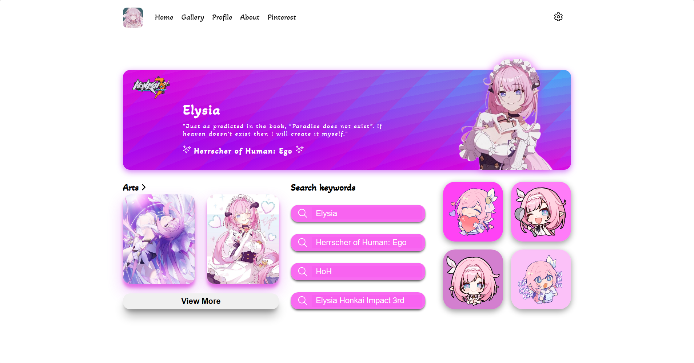
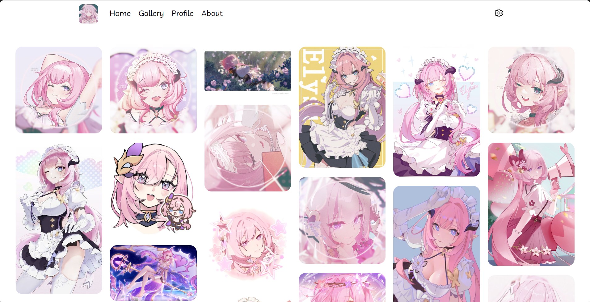
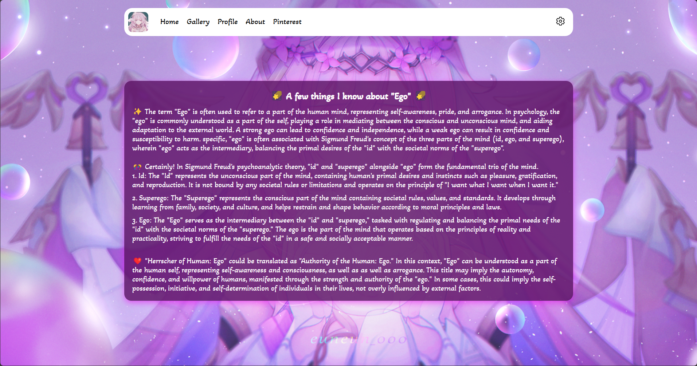

# The first Vue for Elysia website
This project is based on my interests, it is a website using VueJs technology that I just learned about. Thank you for checking it out!🥰🍀
<br>
📌 Note: The website is not responsive yet because I'm too lazy to do it. 🐱


```sh
https://nino.is-a.dev/
```

# 🍀Previews

## 🍀Home Page

## 🍀Gallery

## 🍀About


## 🍀Project Setup


```sh
npm install
```

## 🍀Compile and Minify for Production

```sh
npm run build
```

## 🍀Compile and Hot-Reload for Development
1. On terminal use:
    ```sh
        npm run dev
    ```
2. Click(On terminal) or open url with browser 
    ```sh
    http://localhost:___/
    ```


# 🍀Thanks 🥰🌠
.png)
.gif)